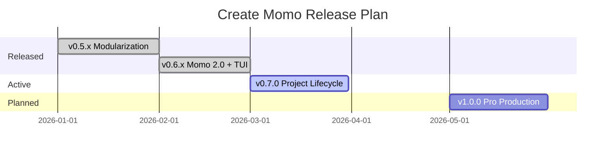

# 🗺️ Create Momo — Version Roadmap

> This document outlines the planned releases, features, and improvements for the **Create Momo** CLI—the ultimate engine to **supercharge and boost** your Turborepo experience.
> Items are grouped by semantic version type: **Patch**, **Minor**, and **Major**.

---

## ✅ v0.5.0 — Minor Release (Modularization & Testing)

Refactor codebase for better maintainability, introduce comprehensive test coverage, and migrate to core utilities.

- [x] **Shared CLI Core**: Extracted logo, colors, and common CLI setup.
- [x] **Unit Testing**: Vitest suite for validators and project utils.
- [x] **Remote Cache**: `momo login/logout` and `momo link` integration.
- [x] **Workspace Hygiene**: `momo clean` for recursive artifact removal.

---

## ✅ v0.6.x — Minor Release (Momo 2.0 Refactor + TUI)

Major architectural refactor, unified command hierarchy, smart scaffolding, internal distribution, and Turbo TUI support.

### Delivered in v0.6.0 — v0.6.1

| Category           | Feature                   | Description                                                                  |
| :----------------- | :------------------------ | :--------------------------------------------------------------------------- |
| **CLI Design**     | **Unified Hierarchy**     | Logical command structure: `add`, `install`, `run`, `setup`.                 |
| **Distribution**   | **Internal Templates**    | Templates moved inside the package for seamless NPM distribution.            |
| **Scaffolding**    | **Blank Flavors**         | Ultra-minimal `blank` templates for rapid workspace creation.                |
|                    | **Smart Routing**         | Automatically detects App vs Package targets using `momo.json`.              |
|                    | **Universal Frameworks**  | Scaffold any framework (`svelte`, `nuxt`, etc.) via `pnpm create` fallbacks. |
| **UI Integration** | **Shadcn UI Protocol**    | Native `shadcn:` protocol support via `momo install`.                        |
| **Dependencies**   | **Smart Install**         | Intelligent `momo install` with workspace protocol detection.                |
| **Turbo TUI**      | **Interactive Dashboard** | Global Turbo Terminal UI for `dev`, `build`, `lint`, `test`, `start`.        |
| **Build Safety**   | **Test-before-Build**     | `turbo.json` enforces tests passing before any build runs.                   |
| **Templates**      | **Next.js 16 + React 19** | All blueprints and components upgraded to latest stable versions.            |

### Status

- [x] Implement Unified Command Hierarchy (Momo 2.0).
- [x] Migrate templates to internal package distribution.
- [x] Implement "Blank" scaffolding for apps and packages.
- [x] Implement Smart Routing logic.
- [x] Implement Universal Framework fallbacks (pnpm create).
- [x] Implement `shadcn:` protocol for component injection.
- [x] Update documentation (READMEs) across the repository.
- [x] Enable Turbo TUI globally across all blueprints.
- [x] Upgrade all templates to Next.js 16 / React 19.2 / latest tools.
- [x] Fix build pipelines: test → build dependency in `turbo.json`.

---

## ✅ v0.7.0 — Minor Release (Project Lifecycle & Adoption)

Tools for managing existing projects over time and adopting Momo in pre-existing monorepos.

| Command                   | Description                                                                                                                 |
| :------------------------ | :-------------------------------------------------------------------------------------------------------------------------- |
| `pnpm create momo .`      | **Adopt/Migrate Mode.** Run inside an existing project to adopt Momo or seamlessly migrate a plain app to a monorepo.       |
| `momo update`             | Dependency manager. Scans workspace `package.json` files, checks npm for outdated packages, and interactively updates them. |
| `momo rename <old> <new>` | Rename a workspace package and update all internal cross-references across the monorepo.                                    |

---

## ⚙️ v0.7.x — Patch Releases (Setup Polish)

| Command                  | Description                                                                                       |
| :----------------------- | :------------------------------------------------------------------------------------------------ |
| `momo setup publish`     | Configure npm publishing: set up changesets and CI release workflows.                             |
| `momo setup open-source` | Add `LICENSE`, `CONTRIBUTING.md`, `CODE_OF_CONDUCT.md` and issue/PR templates.                    |
| `momo doctor` (upgrade)  | Deep validation: checking `momo.config.json`, internal package resolution, and dependency health. |

---

## 🚀 v1.0.0 — Major Release (Deployment & Premium Blueprints)

The full-featured, production-ready release for scale.

- **Unified Deployment**: `momo deploy` with auto-detection for Vercel, Netlify, and Railway.
- **Premium Blueprints**: `momo init --blueprint saas` and `ecommerce` for complex monorepo starts.
- **AI-Assisted Doctor**: Smart suggestions and auto-fixing for monorepo health issues.
- **Documentation Site**: Full docs website at `create-momo.dev`.

---

## 📊 Release Timeline (Tentative)

---

## 📄 License

MIT © [Shahrear Ahamed](https://github.com/shahrear-ahamed)
