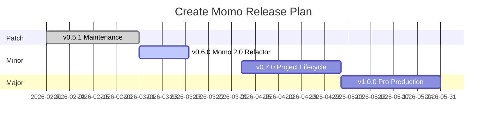

# 🗺️ Create Momo — Version Roadmap

> This document outlines the planned releases, features, and improvements for the **Create Momo** CLI.
> Items are grouped by semantic version type: **Patch**, **Minor**, and **Major**.

---

## ✅ v0.5.0 — Minor Release (Modularization & Testing)

Refactor codebase for better maintainability, introduce comprehensive test coverage, and migrate to core utilities.

- [x] **Shared CLI Core**: Extracted logo, colors, and common CLI setup.
- [x] **Unit Testing**: Vitest suite for validators and project utils.
- [x] **Remote Cache**: `momo login/logout` and `momo link` integration.
- [x] **Workspace Hygiene**: `momo clean` for recursive artifact removal.

---

## 🛡️ v0.6.0 — Minor Release (Momo 2.0 Refactor) ⚡️

Current focus: Major architectural refactor to provide a unified command hierarchy, smart scaffolding, and internal distribution.

### Feature Overview

| Category           | Feature                  | Description                                                                  |
| :----------------- | :----------------------- | :--------------------------------------------------------------------------- |
| **CLI Design**     | **Unified Hierarchy**    | Logical command structure: `add`, `install`, `run`, `setup`.                 |
| **Distribution**   | **Internal Templates**   | Templates moved inside the package for seamless NPM distribution.            |
| **Scaffolding**    | **Blank Flavors**        | Ultra-minimal `blank` templates for rapid workspace creation.                |
|                    | **Smart Routing**        | Automatically detects App vs Package targets using `momo.json`.              |
|                    | **Universal Frameworks** | Scaffold any framework (`svelte`, `nuxt`, etc.) via `pnpm create` fallbacks. |
| **UI Integration** | **Shadcn UI Protocol**   | Native `shadcn:` protocol support via `momo install`.                        |
| **Dependencies**   | **Smart Install**        | Intelligent `momo install` with workspace protocol detection.                |
| **Utility**        | **`momo doctor`**        | Health and standards audit for monorepo projects.                            |
|                    | **`momo list`**          | Enumeration of local and remote component flavors.                           |

### Status

- [x] Implement Unified Command Hierarchy (Momo 2.0).
- [x] Migrate templates to internal package distribution.
- [x] Implement "Blank" scaffolding for apps and packages.
- [x] Implement Smart Routing logic.
- [x] Implement Universal Framework fallbacks (pnpm create).
- [x] Implement `shadcn:` protocol for component injection.
- [x] Update documentation (READMEs) across the repository.
- [ ] Implement `momo setup` (CI, Env, Standards) — _Upcoming_.

---

## ⚙️ v0.7.0 — Minor Release (Project Lifecycle & Adoption)

Tools for managing existing projects over time and adopting Momo in pre-existing monorepos.

| Command                   | Description                                                                                            |
| :------------------------ | :----------------------------------------------------------------------------------------------------- |
| `momo adopt`              | **Integrate Momo into an existing project.** Detects current structure and injects `momo.config.json`. |
| `momo update`             | Sync local shared configs (TypeScript, Tailwind, etc.) with the latest Momo blueprints.                |
| `momo rename <old> <new>` | Rename a workspace package and update all internal references.                                         |
| `momo setup publish`      | Configure npm publishing: set up changesets and CI release workflows.                                  |
| `momo setup open-source`  | Add `LICENSE`, `CONTRIBUTING.md`, and issue/PR templates.                                              |

---

## 🚀 v1.0.0 — Major Release (Deployment & Premium Blueprints)

The full-featured, production-ready release for scale.

- **Unified Deployment**: `momo deploy` with auto-detection for Vercel, Netlify, and Railway.
- **Premium Blueprints**: `momo init --blueprint saas` and `ecommerce` for complex monorepo starts.
- **AI-Assisted Doctor**: Smart suggestions and auto-fixing for monorepo health issues.

---

## 📊 Release Timeline (Tentative)

---

## 📄 License

MIT © [Shahrear Ahamed](https://github.com/shahrear-ahamed)
